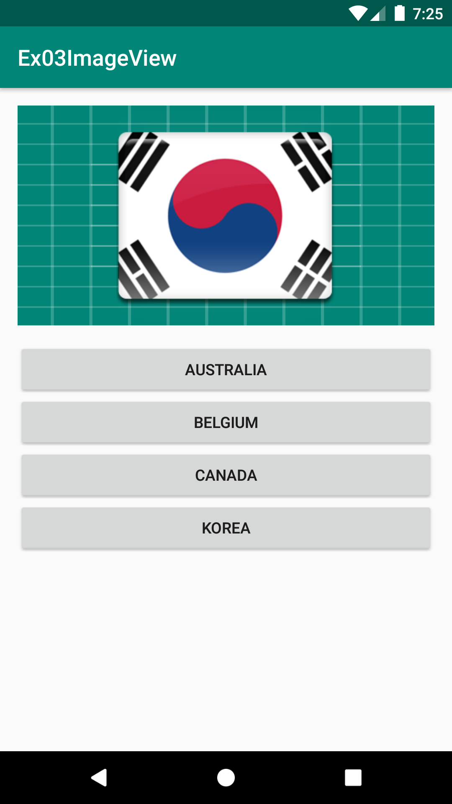
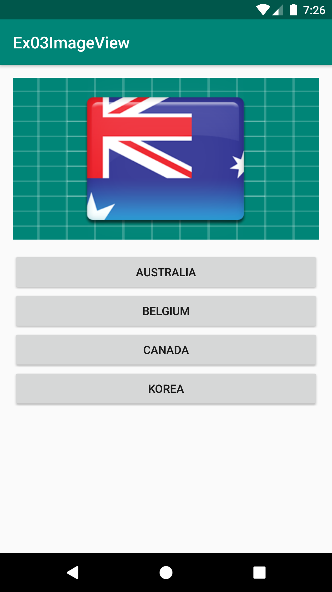
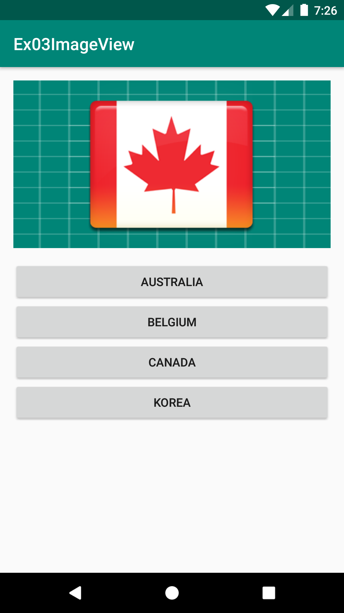
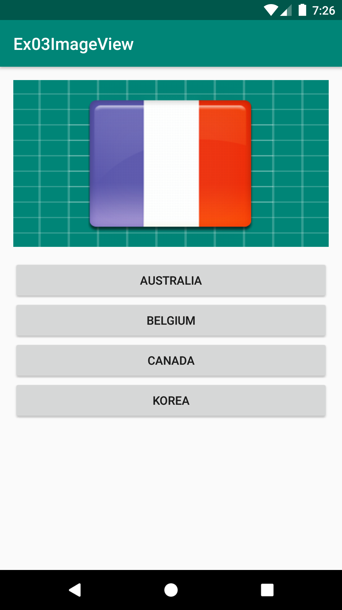
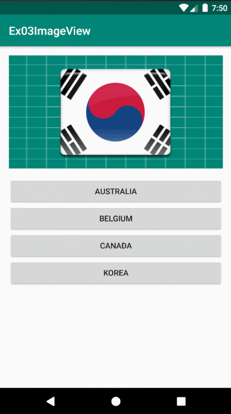

# Ex03ImageView
안드로이드 네이티브 앱 개발 수업 예제#3

# 주요코드
Button 클릭 이벤트를 통해 ImageView 이미지 변경 및 ImageView에 클릭이벤트 적용하기 

- res폴더>>layout폴더안에 있는 activity_main.xml문서를 수정하여 화면제작
- 각각의 버튼을 클릭하였을 때 ImageView가 보여주는 그림을 변경하기
- ImageView에 클릭이벤트를 적용하여 ImageView를 클릭할 때 마다 이미지가 차례로 변경되도록 하기 
  (총 13개의 국기 이미지가 차례로 변경, 마지막 이미지 다음에는 다시 첫번째 이미지로 무한루프)

# 실행모습

  
  
  
  

# 실행모습 GIF

  

